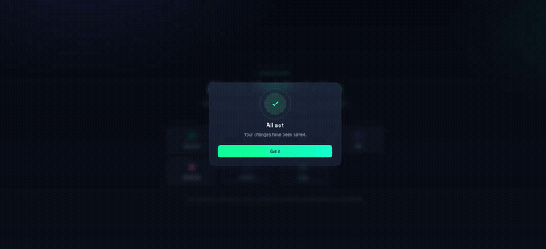

# Nova Alert

A modern, spring-animated alert / confirm / toast library — a drop-in, dependency-free alternative to SweetAlert with smoother, fancier transitions (drawn icons, spring easing, staggered reveals).

**🌐 Live Demo:** https://abhinandanacharya.github.io/nova-alert/



---

# Install

## npm

```bash
npm install nova-alert
```

```javascript
import NovaAlert from "nova-alert";
```

or

```javascript
const NovaAlert = require("nova-alert");
```

---

## CDN (jsDelivr)

No npm install needed. Add these two tags to any HTML page:

```html
<link rel="stylesheet" href="https://cdn.jsdelivr.net/gh/abhinandanacharya/nova-alert@main/dist/nova-alert.min.css">
<script src="https://cdn.jsdelivr.net/gh/abhinandanacharya/nova-alert@main/dist/nova-alert.min.js"></script>
```

That's it — `window.NovaAlert` is now available globally.

> `@main` always serves the latest commit on the `main` branch. For production use, pin to a tagged release instead so updates never break you silently.

Example:

```html
<link rel="stylesheet" href="https://cdn.jsdelivr.net/gh/abhinandanacharya/nova-alert@v1.0.0/dist/nova-alert.min.css">
<script src="https://cdn.jsdelivr.net/gh/abhinandanacharya/nova-alert@v1.0.0/dist/nova-alert.min.js"></script>
```

---

# Usage

```javascript
// Simple alert
NovaAlert.fire({
  type: 'success',
  title: 'All set',
  text: 'Your changes have been saved.'
});

// Auto-dismiss after 2.5s with a progress bar
NovaAlert.fire({
  type: 'info',
  title: 'Syncing…',
  timer: 2500
});

// Confirm dialog
const ok = await NovaAlert.confirm({
  title: 'Delete item?',
  text: 'This will permanently remove the record.',
  confirmLabel: 'Delete',
  cancelLabel: 'Cancel'
});

if (ok) {
  // proceed
}

// Toast
NovaAlert.toast({
  type: 'success',
  title: 'Copied to clipboard'
});
```

---

# API

## `NovaAlert.fire(options)`

| Option | Type | Default | Description |
|--------|------|---------|-------------|
| `type` | `'success' \| 'error' \| 'warning' \| 'info'` | `'info'` | Icon + accent color |
| `title` | `string` | — | Heading text |
| `text` | `string` | — | Body text |
| `confirmLabel` | `string` | `'Got it'` | Button label |
| `timer` | `number` | — | Auto-dismiss with progress bar |
| `allowOutsideClick` | `boolean` | `false` | Prevent closing by clicking outside |
| `allowEscapeKey` | `boolean` | `false` | Allow dismissal with Escape |
| `allowScroll` | `boolean` | `false` | Keep page scrolling enabled |
| `allowKeyboard` | `boolean` | `false` | Enable keyboard interaction |
| `focusConfirm` | `boolean` | `true` | Focus confirm button |
| `allowTimer` | `boolean` | `true` | Disable automatic timer closing when `false` |

Returns a `Promise<boolean>`.

---

## `NovaAlert.confirm(options)`

Same shape as `fire`, plus:

| Option | Type | Default |
|--------|------|---------|
| `cancelLabel` | `string` | `'Cancel'` |

Returns `Promise<boolean>`.

---

## `NovaAlert.toast(options)`

| Option | Type | Default |
|--------|------|---------|
| `type` | same as above | `'info'` |
| `title` | `string` | — |
| `text` | `string` | — |
| `timer` | `number` | `3200` |

---

# Files

```
dist/
  nova-alert.css
  nova-alert.min.css
  nova-alert.js
  nova-alert.min.js

example/
  index.html
```

Works as:

- `window.NovaAlert`
- CommonJS (`require('nova-alert')`)

---

# Publishing Updates

1. Edit the source files in `dist/`.

2. Re-minify:

```bash
npx terser dist/nova-alert.js -c -m -o dist/nova-alert.min.js --comments '/^!/'
npx cleancss -o dist/nova-alert.min.css dist/nova-alert.css
```

3. Commit, push and tag a release.

```bash
git tag v1.0.1
git push --tags
```

4. Purge jsDelivr cache if required:

```
https://purge.jsdelivr.net/gh/abhinandanacharya/nova-alert@main/dist/nova-alert.min.js
```

---

# License

MIT